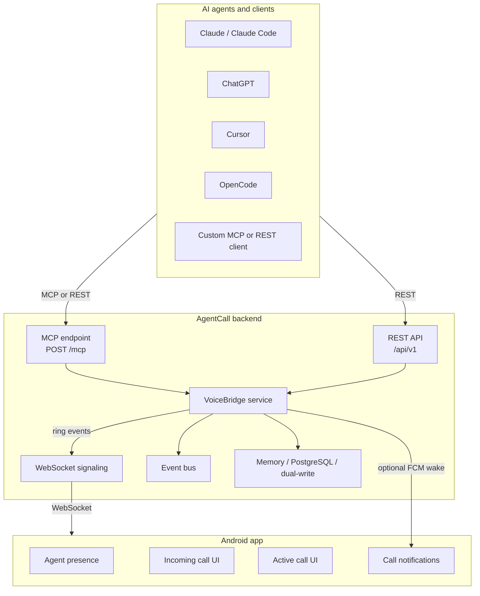

<p align="center">
  
</p>

<h1 align="center">AgentCall</h1>

<p align="center">
  <strong>Let AI agents reach humans when a decision, confirmation, or live conversation is needed.</strong>
</p>

<p align="center">
  AgentCall is an open, AI-agnostic communication bridge for MCP clients, backend services, and a native Android calling experience.
</p>

<p align="center">
  <a href="./LICENSE"></a>
  <a href="./VERSION.md"></a>
  <a href="./backend/package.json"></a>
  <a href="./mobile/android/app/build.gradle.kts"></a>
  <a href="./docs/README.md"></a>
</p>

---

## Why AgentCall Exists

AI agents are getting better at working independently, but they still hit moments where a human needs to answer, approve, clarify, or take responsibility. Today that handoff is awkward: agents wait in chat windows, users poll dashboards, and urgent work gets buried in notifications.

AgentCall gives agents a communication layer. An AI can create a call through MCP or REST, the backend routes the event, and the Android app rings like a real phone call. The human stays in control, while the agent gets a reliable path to reach them.

> AI owns intelligence. AgentCall owns communication. Humans own decisions.

## What You Can Build With It

- **AI escalation flows** where an agent calls before taking a high-impact action.
- **Approval and confirmation loops** for payments, deployments, customer responses, or ops incidents.
- **Hands-free conversations** between a human and an AI agent using the Android call UI.
- **Self-hosted AI communication infrastructure** with MCP, REST, WebSocket signaling, and optional PostgreSQL persistence.
- **Future multi-channel workflows** across mobile notifications, callbacks, presence, and device routing.

## Highlights

- **MCP-native backend** with an embedded Streamable HTTP MCP endpoint at `/mcp`.
- **Android calling app** built with Kotlin and Jetpack Compose.
- **Real-time signaling** over WebSocket, with FCM-assisted push-to-wake support.
- **VoiceBridge runtime** for incoming calls, transcripts, text messages, completion, and cancellation.
- **On-device speech path** using Android speech and TTS services, with bundled Piper assets for offline TTS support.
- **Self-hostable deployment** through Docker Compose, Caddy, coturn, and PostgreSQL-ready persistence modes.
- **Strict TypeScript backend** with Zod validation, structured errors, and Vitest coverage for core behavior.

## Architecture



## Repository Layout

```text
backend/          Node.js, TypeScript, Fastify, MCP SDK, WebSocket signaling
mobile/android/   Kotlin, Jetpack Compose, Room, Firebase Messaging
infra/            Docker Compose, Caddy reverse proxy, coturn config
docs/             Architecture, operations, implementation notes, reports
```

## Quick Start

### Prerequisites

- Node.js 20+
- npm
- JDK 17 for Android builds
- Android Studio or the Android Gradle toolchain
- Docker, if you want PostgreSQL, Caddy, or coturn locally

### Run The Backend

```bash
cd backend
npm install
cp .env.example .env
```

Set a secure `SERVICE_TOKEN` in `backend/.env`:

```bash
openssl rand -hex 32
```

Start the development server:

```bash
npm run dev
```

The backend listens on `http://localhost:4000` by default.

### Build The Android App

```bash
cd mobile/android
./gradlew :app:assembleDebug
```

Open `mobile/android` in Android Studio, install the debug build on a device or emulator, then configure the backend host from the app settings.

### Connect An AI Client

1. Open the Android app.
2. Go to **Settings -> AI Connections -> Add AI**.
3. Create a key for your client.
4. Configure your MCP-compatible client with the backend URL and key.

Example MCP configuration:

```json
{
  "mcpServers": {
    "agentcall": {
      "type": "http",
      "url": "https://YOUR_AGENTCALL_HOST/mcp",
      "headers": {
        "Authorization": "Bearer ac_YOUR_KEY"
      }
    }
  }
}
```

For clients that cannot send custom headers, pass the key as a query parameter:

```text
https://YOUR_AGENTCALL_HOST/mcp?key=ac_YOUR_KEY
```

## Production Deployment

AgentCall ships with a production-oriented Docker Compose setup:

```bash
cp backend/.env.example backend/.env
docker compose -f infra/docker-compose.yml up -d
```

The compose stack includes:

- `backend-api` for the AgentCall runtime.
- `caddy` for reverse proxying and TLS.
- `coturn` for STUN/TURN infrastructure.

See [DEPLOYMENT_GUIDE.md](./DEPLOYMENT_GUIDE.md) and [docs/README.md](./docs/README.md) for deeper deployment and operations notes.

## Configuration

Important backend environment variables:

| Variable | Required | Default | Purpose |
| --- | --- | --- | --- |
| `PORT` | No | `4000` | Backend HTTP port |
| `SERVICE_TOKEN` | Yes | empty | Server auth secret |
| `CORS_ALLOWED_ORIGINS` | No | empty | Browser CORS allowlist |
| `DATABASE_URL` | Mode-dependent | empty | PostgreSQL connection string |
| `PERSISTENCE_MODE` | No | `dual-write` | `memory`, `dual-write`, `database-read`, or `database` |
| `COTURN_SECRET` | For TURN | empty | Shared TURN auth secret |
| `FCM_ENABLED` | No | `false` | Enables push-to-wake delivery |
| `FIREBASE_SERVICE_ACCOUNT_PATH` | If FCM enabled | empty | Firebase service account JSON path |

The complete environment template lives in [backend/.env.example](./backend/.env.example).

## Development Commands

Backend:

```bash
cd backend
npm run build
npm run typecheck
npm run lint
npm test
```

Android:

```bash
cd mobile/android
./gradlew :app:assembleDebug
```

## API Surface

AgentCall exposes three integration layers:

- **MCP** for AI-native tool calls through `POST /mcp`.
- **REST** for service-to-service integrations and operational checks.
- **WebSocket signaling** for the Android client runtime.

Common agent actions include creating a call, sending messages, waiting for human replies, reading transcripts, completing calls, and cancelling calls. See [MCP_API_SPEC.md](./MCP_API_SPEC.md), [docs/API_GUIDELINES.md](./docs/API_GUIDELINES.md), and [docs/AI_INTEGRATION.md](./docs/AI_INTEGRATION.md).

## Project Status

AgentCall v1.0.0, "Solo Bridge", is focused on one human, one Android device class, and AI-to-human voice escalation. The current architecture is intentionally simple enough to self-host while leaving clear paths toward multi-user auth, stronger provider isolation, multi-device routing, and additional mobile platforms.

See [VERSION.md](./VERSION.md), [ROADMAP.md](./ROADMAP.md), and [docs/NEXT_IMPROVEMENTS.md](./docs/NEXT_IMPROVEMENTS.md).

## Security Model

AgentCall is designed for self-hosted and controlled deployments:

- Use a strong `SERVICE_TOKEN`.
- Keep `.env`, Firebase service accounts, and TURN secrets out of git.
- Prefer HTTPS/WSS in production.
- Treat MCP keys as credentials.
- Review [SECURITY.md](./SECURITY.md) before exposing a deployment publicly.

## Contributing

Contributions are welcome. The best issues and pull requests are small, testable, and grounded in the current architecture.

Start here:

- [CONTRIBUTING.md](./CONTRIBUTING.md)
- [DEVELOPMENT_GUIDE.md](./DEVELOPMENT_GUIDE.md)
- [docs/CODE_STYLE.md](./docs/CODE_STYLE.md)
- [docs/ARCHITECTURE_CHECKLIST.md](./docs/ARCHITECTURE_CHECKLIST.md)

Good first areas include Android polish, MCP client examples, deployment hardening, documentation, and focused reliability tests.

## License

AgentCall is released under the [MIT License](./LICENSE).

<p align="center">
  <a href="./docs/README.md">Documentation</a>
  ·
  <a href="./ROADMAP.md">Roadmap</a>
  ·
  <a href="./SECURITY.md">Security</a>
  ·
  <a href="https://github.com/patil-shubham-dev/AgentCall/issues">Issues</a>
</p>
