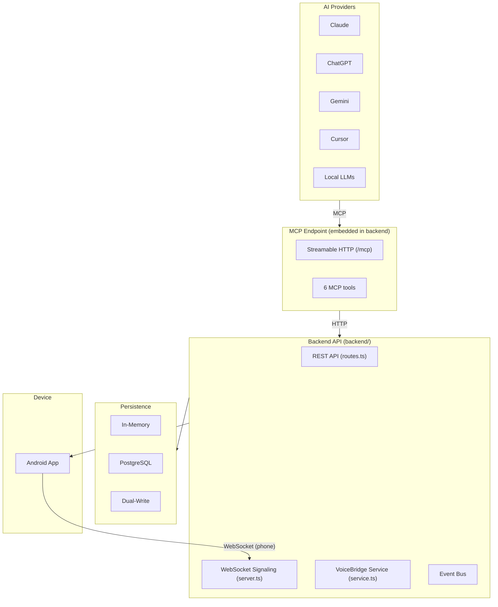

<p align="center">
  <picture>
    <source media="(prefers-color-scheme: dark)" srcset="">
    
  </picture>
</p>

<p align="center">
  <em>The Communication Platform for AI</em>
</p>

<p align="center">
  <a href="#"></a>
  <a href="./LICENSE"></a>
  <a href="#"></a>
  <a href="#"></a>
  <a href="#"></a>
  <a href="#"></a>
  <a href="./docs/README.md"></a>
  <a href="./CHANGELOG.md"></a>
</p>

---

**AgentCall** is an open, AI-agnostic communication platform that enables any AI to securely reach humans through voice, notifications, and future channels. AI agents connect via the MCP protocol — AgentCall handles the rest.

> *AI owns intelligence. AgentCall owns communication. Humans own decisions.*

---

## ✨ Features

- **AI-Agnostic** — Works with Claude, ChatGPT, Gemini, Cursor, local LLMs, and any MCP-compatible agent
- **MCP Native** — 6 built-in MCP tools: `create_call`, `send_message`, `get_transcript`, `complete_call`, `cancel_call`, `send_message_and_wait`
- **Real-Time Voice** — WebSocket-based voice bridge between AI and humans
- **Android App** — Native Kotlin/Jetpack Compose app with incoming call notifications
- **Single-Port Architecture** — HTTP, WebSocket, and health probes on one port
- **Flexible Persistence** — Memory-only, PostgreSQL, or dual-write modes
- **Event-Driven Core** — In-process EventBus with subscriber hooks, scoped subscriptions, priority ordering
- **Privacy First** — No recording, no transcript retention by default
- **Free First** — No paid APIs, no cloud dependencies, fully self-hosted

---

## 🏗 Architecture



> Full architecture: [ARCHITECTURE.md](./ARCHITECTURE.md) · [ARCHITECTURE_BASELINE.md](./ARCHITECTURE_BASELINE.md)

---

## 📱 Screenshots

<!--
Add screenshots here once available:
- Android app call screen
- Backend startup logs
- MCP tool invocation example


-->

*Screenshots coming soon.*

---

## 🚀 Quick Start

### Prerequisites

- Node.js 20+
- npm
- Android phone or emulator (for mobile)

### 1. Backend

```bash
cd backend
cp .env.example .env
# Edit .env: set SERVICE_TOKEN to a random 64-char hex string
npm install
npm run dev
# → http://localhost:4000
```

### 2. Android App

```bash
# Open mobile/android/ in Android Studio
# Build and deploy to your device
# Enter your server URL in Settings
```

### 3. Connect an AI Agent (MCP over HTTP)

The MCP server is embedded in the backend (`POST /mcp`, Streamable HTTP). Each AI client gets its own key:

1. Open the Android app → **Settings → AI Connections → Add AI** and type a name (e.g. "Claude").
2. The app shows a one-time key (`ac_...`) with ready-made snippets for Claude/Claude Code, Cursor, Opencode, and ChatGPT.

Claude Desktop / Claude Code:

```json
{
  "mcpServers": {
    "agentcall": {
      "type": "http",
      "url": "https://YOUR_SERVER/mcp",
      "headers": { "Authorization": "Bearer ac_YOUR_KEY" }
    }
  }
}
```

ChatGPT (query-param auth, no header support):

```
https://YOUR_SERVER/mcp?key=ac_YOUR_KEY
```

---

## 🛠 Installation

### Docker Compose (Recommended for Production)

```bash
git clone https://github.com/agentcall/agentcall.git
cd agentcall

# Set up environment
cp backend/.env.example backend/.env
# Edit backend/.env with your configuration

# Start services
docker compose -f infra/docker-compose.yml up -d
# → http://localhost:4000
```

### Kubernetes

```bash
kubectl apply -f infra/k8s/01-namespace.yaml
kubectl apply -f infra/k8s/02-secret-template.yaml
# Edit secrets with your values
kubectl apply -f infra/k8s/
```

> Full deployment guide: [DEPLOYMENT_GUIDE.md](./DEPLOYMENT_GUIDE.md)

---

## 🔧 Environment Variables

| Variable | Default | Required | Description |
|----------|---------|----------|-------------|
| `PORT` | `4000` | No | HTTP server port |
| `NODE_ENV` | `development` | No | Runtime environment |
| `SERVICE_TOKEN` | — | **Yes** | Auth token (`openssl rand -hex 32`) |
| `CORS_ALLOWED_ORIGINS` | `*` | No | CORS origins |
| `BODY_LIMIT_BYTES` | `1048576` | No | Max request body |
| `DATABASE_URL` | — | No* | PostgreSQL connection string |
| `PERSISTENCE_MODE` | `dual-write` | No | `memory`, `database`, `dual-write`, `database-read` |
| `DB_POOL_MIN` | `2` | No | Minimum pool connections |
| `DB_POOL_MAX` | `10` | No | Maximum pool connections |

*\* Required when `PERSISTENCE_MODE=database` or `database-read`.*

---

## 📖 Examples

### Create a Call via MCP

```json
{
  "jsonrpc": "2.0",
  "id": 1,
  "method": "tools/call",
  "params": {
    "name": "create_call",
    "arguments": {
      "user_id": "user_abc123",
      "phone_number": "+1234567890",
      "context": "Payment confirmation required"
    }
  }
}
```

### REST API Health Check

```bash
curl http://localhost:4000/api/v1/health
# → {"status":"ok","uptime":1234,"mode":"dual-write"}
```

> Full API reference: [API_SPEC.md](./API_SPEC.md)

---

## 📚 Documentation

| Area | Document |
|------|----------|
| 📖 **Documentation Hub** | [docs/README.md](./docs/README.md) |
| 🏗 **Architecture** | [ARCHITECTURE.md](./ARCHITECTURE.md) · [SYSTEM_ARCHITECTURE.md](./SYSTEM_ARCHITECTURE.md) · [ARCHITECTURE_BASELINE.md](./ARCHITECTURE_BASELINE.md) |
| 📡 **API** | [API_SPEC.md](./API_SPEC.md) · [API_GUIDELINES.md](./docs/API_GUIDELINES.md) |
| 🚢 **Deployment** | [DEPLOYMENT_GUIDE.md](./DEPLOYMENT_GUIDE.md) · [PRODUCTION_READINESS.md](./PRODUCTION_READINESS.md) |
| 🗄️ **Database** | [DATABASE_GUIDE.md](./DATABASE_GUIDE.md) |
| ⚙️ **Operations** | [OPERATIONS_BASELINE.md](./OPERATIONS_BASELINE.md) · [KNOWN_LIMITATIONS.md](./KNOWN_LIMITATIONS.md) |
| 🔒 **Security** | [SECURITY.md](./SECURITY.md) · [SECURITY_GUIDELINES.md](./docs/SECURITY_GUIDELINES.md) |
| 💻 **Development** | [DEVELOPMENT_GUIDE.md](./DEVELOPMENT_GUIDE.md) · [TESTING_GUIDE.md](./docs/TESTING_GUIDE.md) |
| 🤖 **AI Integration** | [AI_INTEGRATION.md](./docs/AI_INTEGRATION.md) · [MULTI_PROVIDER_PLAN.md](./docs/MULTI_PROVIDER_PLAN.md) |

---

## 🗺 Roadmap

| Version | Focus | Status |
|---------|-------|--------|
| **v1.0** "Solo Bridge" | VoiceBridge: AI-to-human voice calls | ✅ Released |
| **v1.1** | Cross-pod session lock, WebSocket drain, migration tooling | 🔜 Planned |
| **v2.0** | Multi-user auth (RBAC/JWT), iOS app, multi-region | 🔮 Future |

See [ROADMAP.md](./ROADMAP.md) and [IMPLEMENTATION_ROADMAP.md](./docs/IMPLEMENTATION_ROADMAP.md).

---

## 🤝 Contributing

We welcome contributions from the community!

- [CONTRIBUTING.md](./CONTRIBUTING.md) — Contribution guidelines
- [CODE_OF_CONDUCT.md](./CODE_OF_CONDUCT.md) — Community standards
- [CODE_STYLE.md](./docs/CODE_STYLE.md) — Coding conventions
- [ARCHITECTURE_CHECKLIST.md](./docs/ARCHITECTURE_CHECKLIST.md) — PR review checklist

---

## 🔒 Security

Found a vulnerability? See our [security policy](./SECURITY.md) for responsible disclosure.

---

## 🙏 Acknowledgements

AgentCall is built on open-source foundations:

- [Fastify](https://fastify.dev/) — HTTP framework
- [TypeScript](https://www.typescriptlang.org/) — Language
- [MCP Protocol](https://modelcontextprotocol.io/) — AI integration standard
- [Jetpack Compose](https://developer.android.com/jetpack/compose) — Android UI
- [Vitest](https://vitest.dev/) — Testing framework
- All our [contributors](https://github.com/agentcall/agentcall/graphs/contributors)

---

## 📄 License

[MIT](./LICENSE) © 2026 AgentCall

---

<p align="center">
  <a href="https://github.com/agentcall/agentcall">GitHub</a> ·
  <a href="./docs/README.md">Documentation</a> ·
  <a href="./CHANGELOG.md">Changelog</a> ·
  <a href="https://github.com/agentcall/agentcall/discussions">Discussions</a>
</p>
