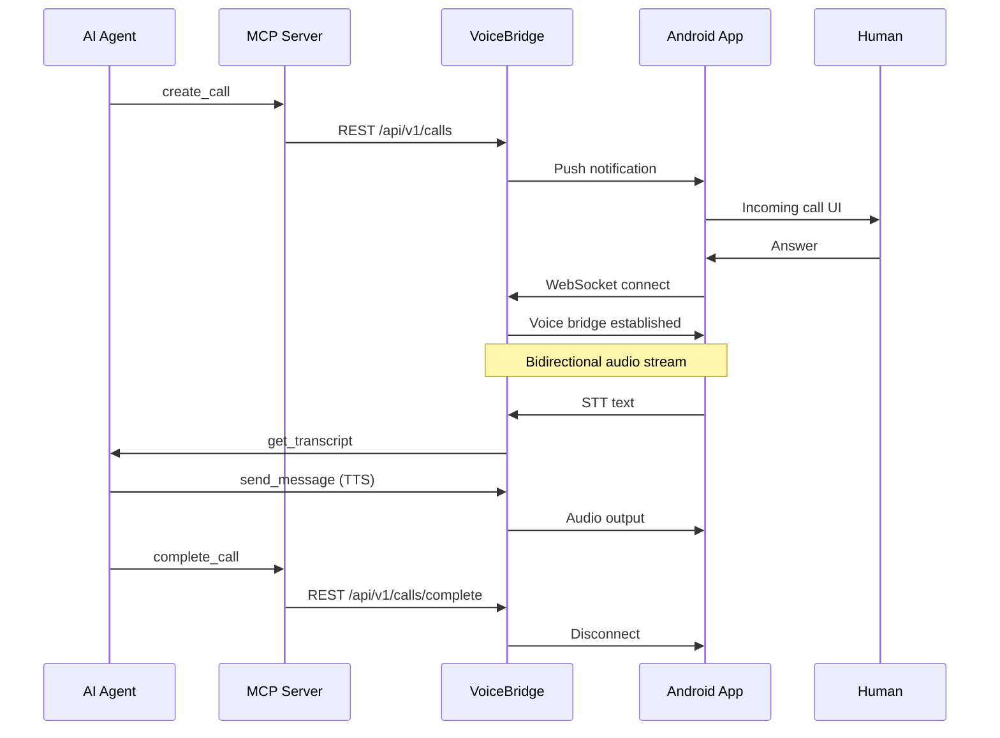

# README Visual Plan — VoiceBridge

## Current Gap

The README currently has:
- A Mermaid flowchart (architecture) — already present, good quality
- Placeholder hero image (empty `<picture>` tag with empty `srcset`/`src`)
- Placeholder screenshot section with "Screenshots coming soon" text

The README needs 4-5 visual assets to reach professional open-source quality.

---

## 1. Hero Image (Repository Social Preview)

### Location
Top of README, replacing the current empty `<picture>` block.

### Description
A 1280×640 social preview card with:
- Background: dark gradient (#0d1117 → #161b22) matching GitHub dark theme
- Left side: AgentCall logo — stylized "AC" monogram in a rounded square, or a phone tower / signal wave icon in gradient blue (#58a6ff → #1f6feb)
- Right side: Tagline in two lines — "The Communication Platform for AI" / "Open. AI-Agnostic. Self-Hosted."
- Bottom-right: Small "v1.0.0" badge

### Color Palette
- Background: `#0d1117` → `#161b22` (GitHub dark)
- Accent: `#58a6ff` (blue)
- Text: `#c9d1d9` (light gray)
- Logo: `#58a6ff` → `#1f6feb` gradient

### Dimensions
- Standard GitHub social preview: 1280×640px
- README inline display: 800px wide (centered)

### Format
PNG (lossless, ~50-100KB). Optimize with `pngquant` or Squoosh.

### For AI Image Generation

```text
Prompt: "A social preview card for an open-source project called 'AgentCall'.
Split layout. Left side: stylized antenna/signal tower icon in gradient blue on
dark background. Right side: text 'The Communication Platform for AI' and
'Open · AI-Agnostic · Self-Hosted' in light gray. Dark theme
(#0d1117 background). Modern, clean, developer-focused aesthetic. 1280x640."
```

---

## 2. Mermaid Architecture Diagram

### Location
Lines 47-88 — already exists.

### Current State
✅ Already present and functional. The Mermaid flowchart shows:
- AI Providers (Claude, ChatGPT, Gemini, Cursor, Local LLMs)
- Integration Layer (MCP Protocol, REST API)
- AgentCall Runtime (12 internal components)
- Communication Channels (Android, Future iOS, Desktop, Web)
- Human User node

### Enhancement (Optional)
The diagram would benefit from adding:
- PostgreSQL at the bottom connected to History Service + Call Manager
- Color styling: blue boxes for external, green for runtime, orange for devices
- This can be done with Mermaid `style` directives

---

## 3. Terminal Demo GIF (asciicast)

### Location
Between Features and Architecture sections (after line 42, before "Architecture").

### Description
A 120-second terminal recording (via `agg` or `termtosvg`) showing:

```
Scene 1 (30s): Backend startup
$ cd agentcall/backend
$ npm install
$ npm run dev
> [HTTP] Server listening on http://localhost:4000
> [WS] WebSocket server ready
> [DB] Connected in dual-write mode
> [EVENT] Event bus initialized (14 subscribers)
> [HEALTH] All systems OK

Scene 2 (30s): MCP tool invocation
$ claude --mcp-servers "agentcall=node mcp-server/dist/index.js"
> [MCP] create_call → call_abc123 created
> [MCP] send_message → message sent to user
> [MCP] get_transcript → transcript returned

Scene 3 (30s): REST API health check
$ curl http://localhost:4000/api/v1/health
> {"status":"ok","uptime":42,"mode":"dual-write",...}

Scene 4 (30s): WebSocket connection log
> [WS] New connection: phone_xyz
> [WS] Registered: user_abc123
> [VOICE] Call call_abc123: connected
```

### Format
- GIF (max 5MB, 800×600, 30 fps)
- Use `agg` (https://github.com/asciinema/agg) to record asciicast → GIF
- Or use `vhs` (https://github.com/charmbracelet/vhs) for scripted recording
- Dark terminal theme (Dracula or One Dark)
- Font: JetBrains Mono 14px

### Fallback (if GIF is too large)
- Use SVG terminal recording via `termtosvg`
- SVG files are typically smaller and scale better
- Can be styled with CSS variables for dark/light mode

---

## 4. Sequence Diagram (Call Lifecycle)

### Location
After Quick Start, before Installation (after line 149).

### Description
A diagram showing the message flow for a complete call lifecycle:

```
AI Agent          MCP Server      VoiceBridge      Android App       Human
    │                  │               │               │               │
    │── create_call ──→│               │               │               │
    │                  │─── REST ─────→│               │               │
    │                  │               │── notification ─→│            │
    │                  │               │               │── ring ─────→│
    │                  │               │               │               │── answer
    │                  │               │               │←─ answer ────│
    │                  │               │←─ WS connect ─│               │
    │                  │               │═══ voice bridge ══════════════│
    │                  │               │── STT ───────→│               │
    │                  │               │←─ text ───────│               │
    │                  │               │── TTS ───────→│               │
    │                  │               │←─ audio ──────│               │
    │── transcript ───→│               │               │               │
    │                  │── complete ──→│               │               │
    │                  │               │── disconnect ─→│               │
```

### Format
Also Mermaid (sequence diagram), placed inline in the README:



---

## 5. Dashboard Screenshot (Grafana / Observability)

### Location
In Operations section of docs/README.md, or in OPERATIONS_BASELINE.md.

### Description
A sample Grafana dashboard showing:
- Top row: Uptime, Active Calls, WebSocket Connections, Error Rate
- Middle: Request latency (p50, p95, p99) — time series
- Bottom: Event bus metrics (queue depth, circuit breaker state)
- Left sidebar visible with "VoiceBridge" dashboard name
- Data can be synthetic — doesn't need real deployment

### Format
- PNG, 1920×1080, ~200KB
- Dark theme (Grafana default)
- Use `grafana-image-renderer` plugin or browser screenshot

---

## Implementation Priority

| Asset | Effort | Impact | Priority |
|-------|--------|--------|----------|
| 1. Hero image | 1h (AI generation + edit) | High — first thing visitors see | P0 |
| 2. Terminal demo GIF | 2h (record + optimize) | High — shows the project in action | P0 |
| 3. Sequence diagram | 30min (Mermaid code) | Medium — clarifies call flow | P1 |
| 4. Dashboard screenshot | 1h (Grafana setup + screenshot) | Low — nice to have | P2 |
| 5. Mermaid enhancements | 30min (style directives) | Low — nice to have | P2 |

### Quick Wins (30 min or less)
1. Add Mermaid sequence diagram — pure text, no image generation needed
2. Enhance Mermaid architecture diagram with color styling via `style` directives
3. Replace hero image placeholder with an AI-generated PNG

### Files to Update
- `README.md` — hero image, sequence diagram, terminal demo GIF
- `docs/README.md` — dashboard screenshot link (optional)

### Directory Structure for Assets
```
docs/
  screenshots/
    hero.png                 # Social preview card
    terminal-demo.gif        # Terminal recording
    dashboard.png            # Grafana dashboard (optional)
```

Do NOT create these images. This document describes exactly what to create and where to place them.
